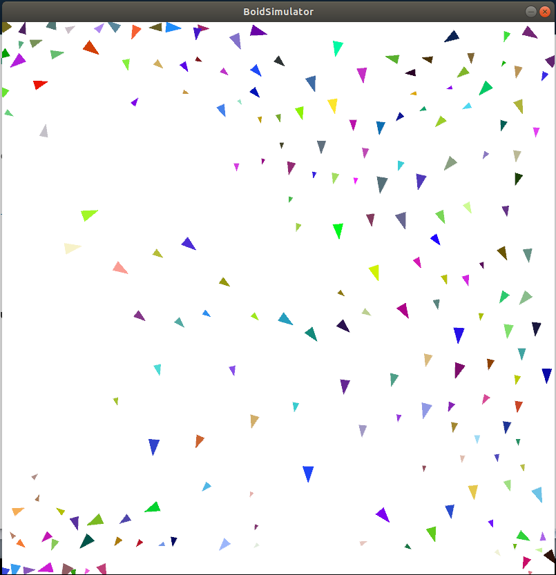
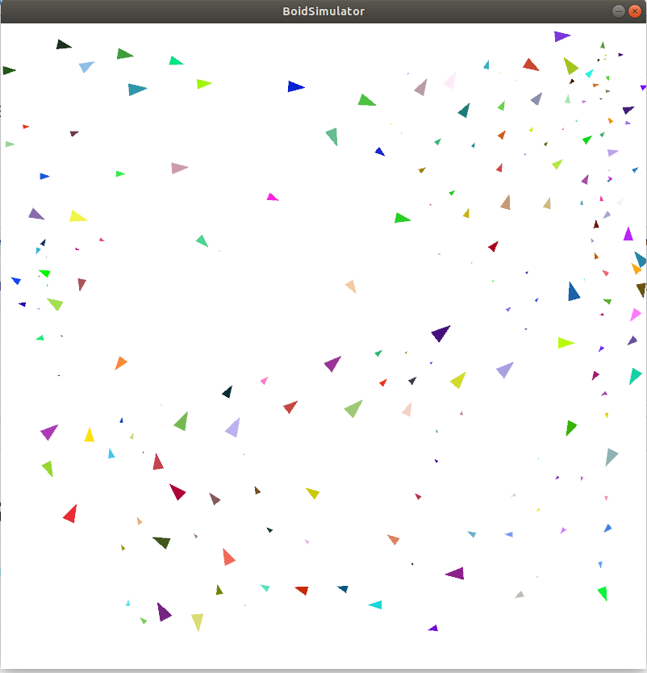
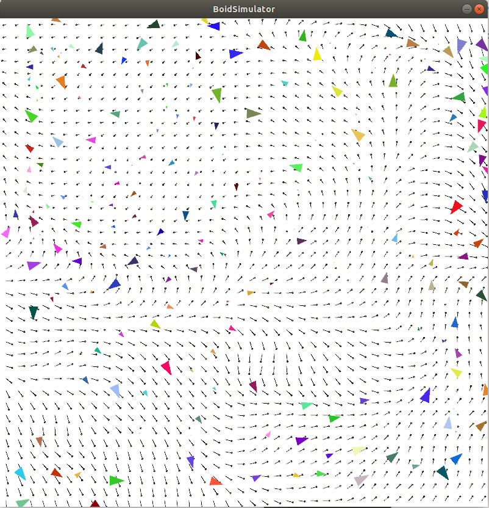

# Boid-Simulator
Swarm Intelligence (Boids) simulator, created using Processing  

## How To Play
- Open processing IDE
- Open BoidSimulator.pde
- <b>(Optional)</b> comment / uncomment drawWindMap() in draw() to show / hide force field
- Press play

## Feature
- Flocking
- Collision avoidance (Other boids) 
- Matching flock velocity
- Force field (generated using Perlin Noise)
- Boid growth (and death)

## Image

## Todo
- Attractor (attract boids to go there)
- Predator (chase and eat boids)

## Contact
<b>adityaputra159@gmail.com</b>